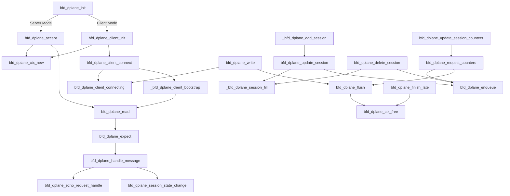

# FRR bgp 管理守护进程

> Bgp 管理控制器守护进程，基于 frr 的守护进程框架编写

---

## 守护进程代码框架

详情查看： [Pull request](https://github.com/ChocoLZS/frr/pull/1) 中构建相关的 diff
以及 [main 函数](bgpmgmtd/bgpmgmtd_main.c)

---

## socket server 原理

- [精简原型](#side_scoketc-精简后的-socket-server-原型)
- [项目实际 socket 代码](#实际-socket-代码)
- [参考代码](#bfdddplanec-参考代码的函数关系调用图)

仿照 [bfdd/dplane.c](../bfdd/dplane.c)

### `side_scoket.c` 精简后的 socket server 原型

> powered by **claude sonnet 3.5**，可供学习参考

共四个函数：

1. `side_socket_init`: 守护进程调用的初始化函数
2. `side_socket_accept`: 建立连接 sock 的函数
3. `side_socket_read`: 从对端 socket 读取数据的函数
4. `side_socket_clean`: socket server 销毁函数

**调用关系图**

### 实际 socket 代码

> 考虑到需要结构化数据包的可能性，以及相关回调函数的编写，需要考虑更多相对复杂的编写方式来实现目的

源码：[`bgpmgmt.c`](bgpmgmt.c)， [`bgpmgmt.h`](bgpmgmt.h)
基本仿照 [bfdd/dplane.c](../bfdd/dplane.c) socket 相关部分，即下图的左半部分

在 main 函数初始化完毕后，后续的包处理只需要在 bgpmgmt.c:152 进行即可

### `bfdd/dplane.c` 参考代码的函数关系调用图

> powered by **claude sonnet 3.5**

